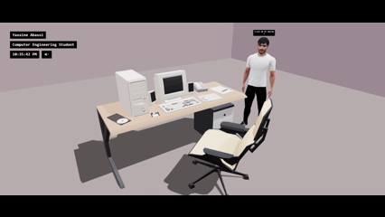
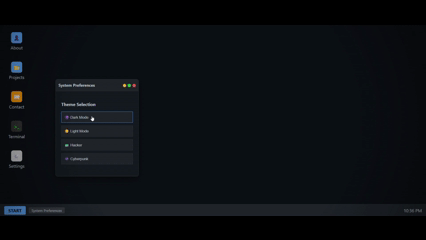

# 🖥️ Yassine's 3D Interactive Portfolio
> "Why build a simple portfolio when you can build a computer?"

Welcome to my personal workspace, digitized. This project isn't just a gallery of my work, it's a high-performance 3D environment built with React and Three.js that puts you in the driver's seat of my creative process.

Click here to see live demo: 

## 🌟 The Experience
✔️Immersive 3D Room: A custom-designed workspace featuring realistic lighting, shadows, and smooth camera rigging.

✔️Functional Virtual OS: Click on the computer screen to enter a fully interactive web-based operating system.

✔️Retro Terminal: A functional bash-style terminal supporting commands like help, about, and projects.

✔️Dynamic Themes: Toggle between Dark, Light, Hacker, and Cyberpunk modes within the virtual settings.

## 🛠️ Tech Stack
### Core
React.js: For component-based UI and state management.

Three.js / React-Three-Fiber: Powering the 3D engine and scene rendering.

Drei: To simplify 3D helpers like OrbitControls and GLTF loading.

### The "OS" Logic
Tailwind / CSS-in-JS: For the retro window management and CRT screen effects.

EmailJS: Handling real-time contact form submissions directly from the virtual desktop.

## 🚀 Quick Start
Want to see how the "under the hood" logic works?

Clone the repo:
`git clone https://github.com/Yassine020528/3D-Portfolio.git`

Install dependencies:
`npm install`

Run locally:
`npm run dev`
